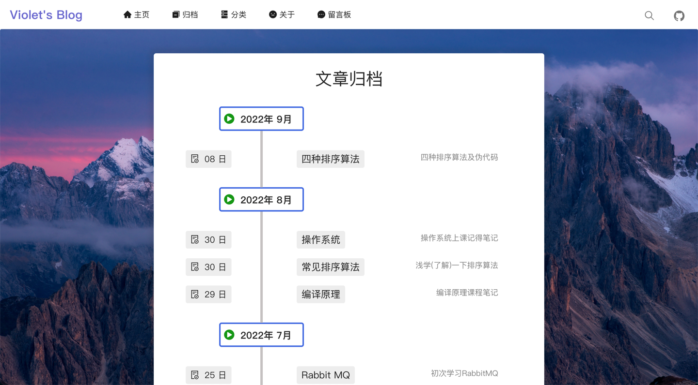
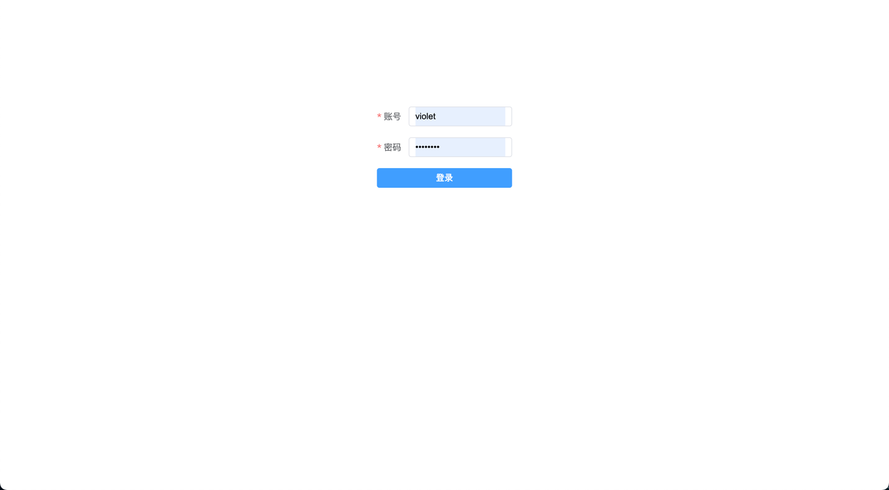
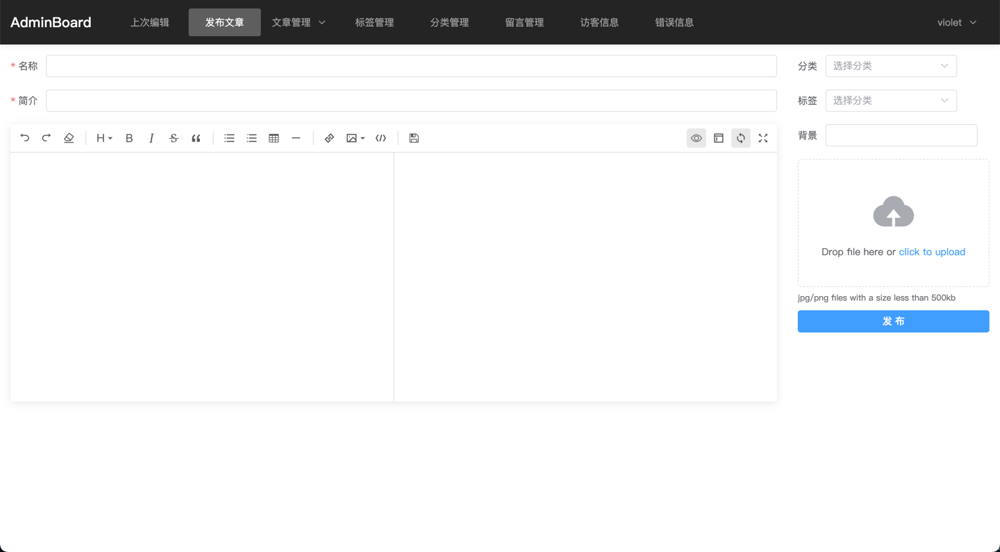

# 简介
Springboot + Vue 实现的个人博客，前端包含展示页面和管理页面。

自己目前使用的博客，后期应该不会有大变化，所以不再更新，有问题请提issue

前台页面：https://beyondhorizon.top/

后台暂时不公开，底下有预览图
# 后端
1. 核心框架：Springboot
2. dao框架：Mybatis-plus
3. 安全框架：shiro
4. token：jjwt
5. 图片存储：腾讯云cos
6. 短信服务：腾讯云sms

使用redis保存session，博客以longtext格式保存在mysql
# 前端
前端核心：vue，vue-router，axios
基于vite的vue@3.2.25
- 使用ui框架：Element-plus，Ant-design，tdesign-vue-next
- Markdown编辑器：@kangc/v-md-editor
- Markdown解析：markdown-it
- 代码语法高亮：highlight.js
- 页面加载进度条：nprogress
- 代码复制：clipboard
## 前台UI
Element-plus，Ant-design，tdesign-vue-next，semantic-ui-vue
## 后台UI
Element-plus，tdesign-vue-next
# 预览图
## 前台
### 主页

### 归档

### 分类

### 关于

### 留言板

### 文章详情

## 后台
### 首页

### 登陆

### 发布文章

### 文章管理

### 分类管理

### 标签管理

### 留言管理

### 访客信息

### 错误日志

# LICENSE
MIT